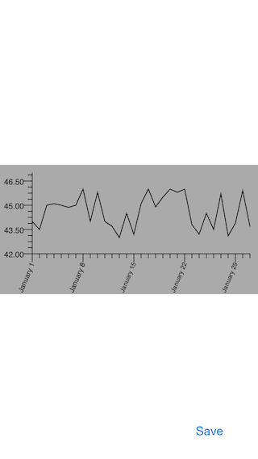

# GraphView

A scatter plot view implemented in Objective-C.

## Installation

Add ACScatterPlotView folder in your project. It contains ACScatterPlotView, ACAxis, ACAxisRange.

## Usage

    self.scatterPlotView = [[ACScatterPlotView alloc]
    initWithFrame:self.viewScatterPlotViewContainer.bounds];
    [self.viewScatterPlotViewContainer addSubview:self.scatterPlotView];

    self.scatterPlotView.dataSource = self;
    self.scatterPlotView.delegate = self;
    //    self.scatterPlotView.resolution = [NSNumber numberWithDouble:2.0]; // Text labels position bug when resolution is different

    ACAxisRange *xAxisRange = [ACAxisRange axisRangeWithMinimum:1 andMaximum:31];
    self.scatterPlotView.xAxisRange = xAxisRange;
    self.scatterPlotView.leftInset = [NSNumber numberWithDouble:30];
    self.scatterPlotView.bottomInset = [NSNumber numberWithDouble:40];
    self.scatterPlotView.rotationAngleOfLabels = [NSNumber numberWithDouble:3*M_PI/8];

    // 31 days
    double values[31] = {44.0, 43.5, 45.0, 45.1, 45.0, 44.87,
    45.0, 46, 44.0, 45.8, 44, 43.7,
    43.0, 44.5, 43.2, 45.1, 46.0, 44.9,
    45.5, 46.0, 45.8, 46.0, 43.8, 43.21,
    44.5, 43.5, 45.7, 43.1, 43.9, 45.9, 43.7};
    self.yValues = @[].mutableCopy;
    for (int i = 0; i < 31; i++) {
    [self.yValues addObject:[NSNumber numberWithDouble:values[i]]];
    }
    //    ACAxisRange *yAxisRange = [ACAxisRange axisRangeGenerateMinimumAndMaximumUsingNumbersInArray:self.yValues];
    //    self.scatterPlotView.yAxisRange = yAxisRange;

    ACAxisRange *yAxisRange = [ACAxisRange axisRangeWithMinimum:42 andMaximum:47];
    self.scatterPlotView.yAxisRange = yAxisRange;

    ACAxis *xAxis = [[ACAxis alloc] init];
    xAxis.majorIntervalLength = [NSNumber numberWithDouble:7];
    xAxis.minorTicksBetweenMajorIntervals = [NSNumber numberWithInt:6];
    //    xAxis.labelFontSize = 20;
    self.scatterPlotView.xAxis = xAxis;

    ACAxis *yAxis = [[ACAxis alloc] init];
    yAxis.majorIntervalLength = [NSNumber numberWithDouble:1.5];
    yAxis.minorTicksBetweenMajorIntervals = [NSNumber numberWithInt:3];
    self.scatterPlotView.yAxis = yAxis;
    self.scatterPlotView.stepSize = [NSNumber numberWithDouble:1];

    [self.scatterPlotView drawScatterPlot];

## License

Copyright (c) 2015 Joe Christopher Paul Amanse. This software is licensed under the [MIT License](./LICENSE.md)

